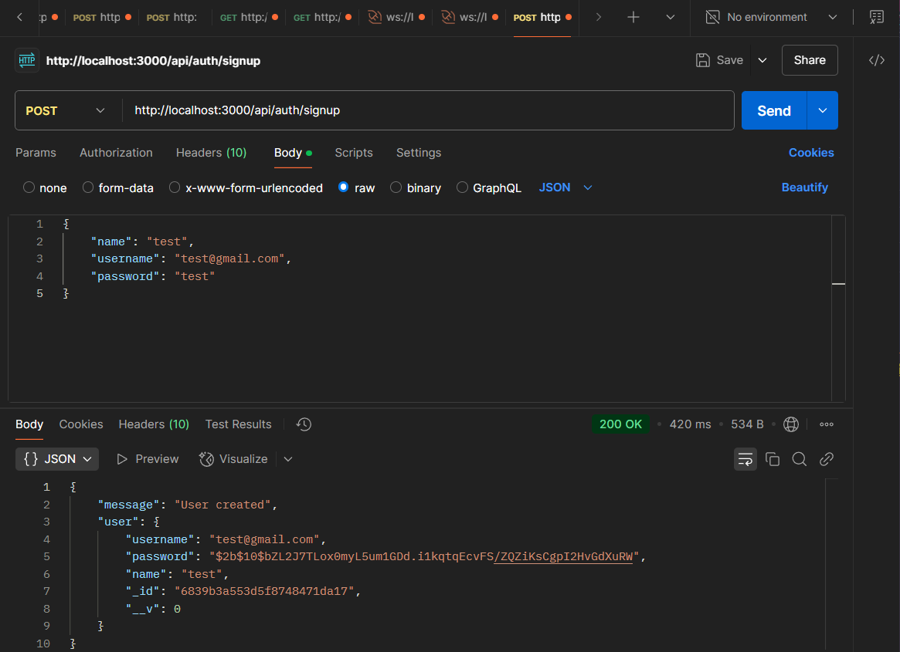
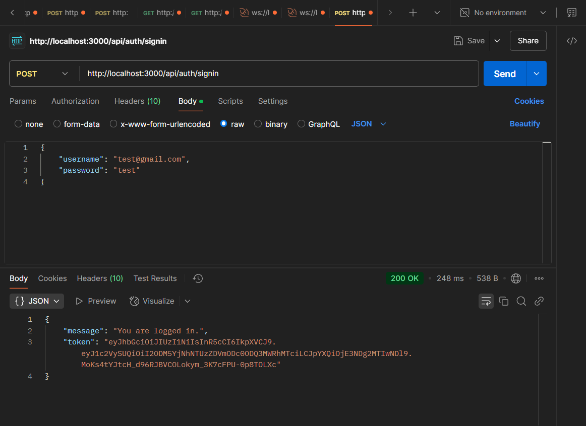
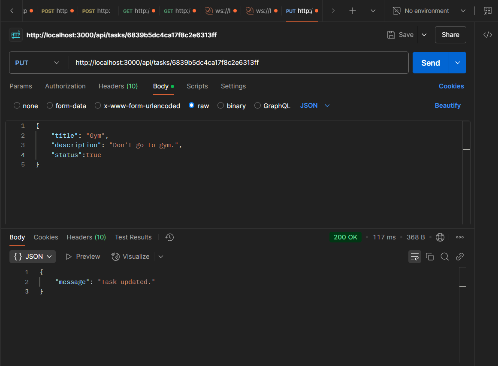
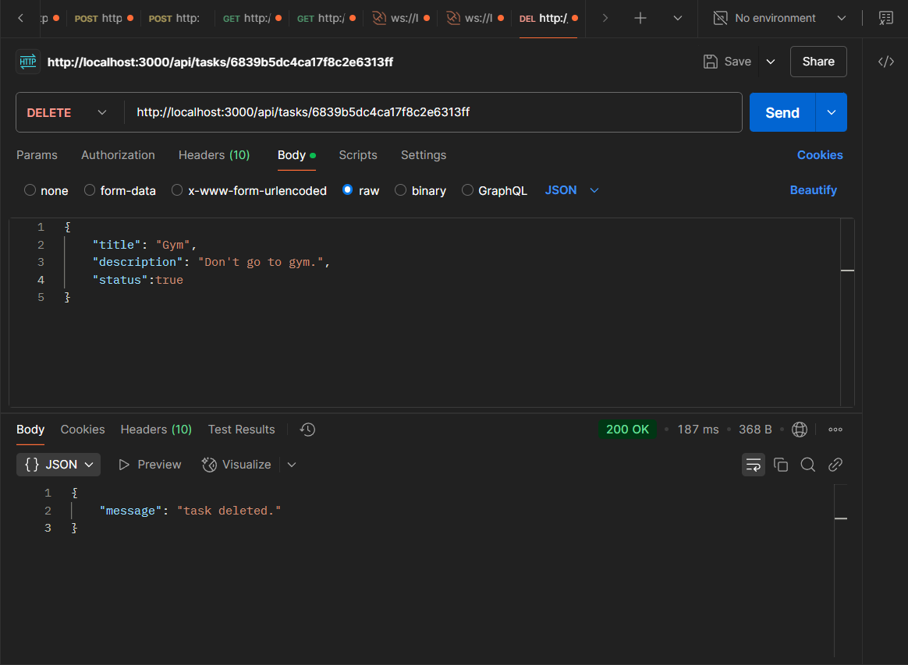

# 🧩 Task Manager Backend API

This is the backend for a Task Manager application built with **Node.js**, **Express.js**, and **MongoDB**. It provides RESTful API endpoints for user authentication and task management.

## 🚀 Features

- User registration and login (with JWT-based authentication)
- Secure password hashing using bcrypt
- CRUD operations for tasks (Create, Read, Update, Delete)
- Protected routes with authentication middleware
- MongoDB integration via Mongoose
- Environment variable configuration

---

## 🛠️ Tech Stack

- Node.js
- Express.js
- MongoDB & Mongoose
- JSON Web Tokens (JWT)
- bcryptjs
- dotenv

---

### 🧾 Signup Request (Postman)

### 🔐 Login Response (Postman)

### 📥 Add Tasks (Authenticated Request)

### ✏️ Update Task Request (Postman)
  

### 🗑️ Delete Task Request (Postman)
  

